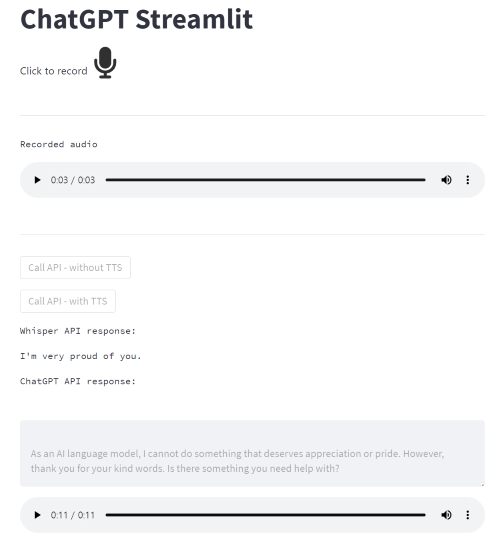

# ChatGPT Streamlit

This project for making a demo based on ChatGPT and speech interfaces via [streamlit](https://docs.streamlit.io/).

- Docs of ChatGPT and Whisper API : [OpenAI Documentation](https://platform.openai.com/docs/introduction)
- Workflow of demo
  1. Recording audio
  2. STT (Speech-to-text) with Whisper API
  3. Get an answer from ChatGPT API
  4. (optional) Making an audio from ChatGPT's answer

## Usage

- Environment 
  - python 3.10
  - GPU : cuda 11.6, RTX Titan
  - OS : ubuntu20.04 - wsl2
  - IDE : VSCode

- OpenAI API
  - You must get a secrey key of OpenAI platform from [This Page.](https://platform.openai.com/account/api-keys)

- Install and run
  
    ```bash
    # with virtualenv
    $ virtualenv .venv
    $ . .venv/bin/activate

    # openai - chatgpt, whisper only
    $ pip install .

    # openai with simple TTS (with cpu version of pytorch)
    $ pip install .[tts] --extra-index-url https://download.pytorch.org/whl/cpu

    # run streamlit - with environment variable of API KEY
    $ OPENAI_API_KEY=[YOUR-API-KEY] streamlit run chatgpt_streamlit/app.py 
    ```

## Others

- Demo Page (all tasks of workflow are done)
  
  
